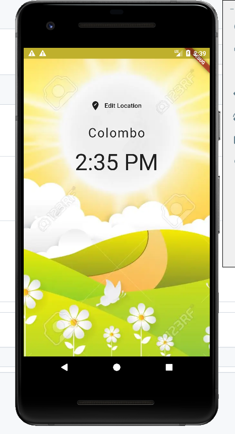
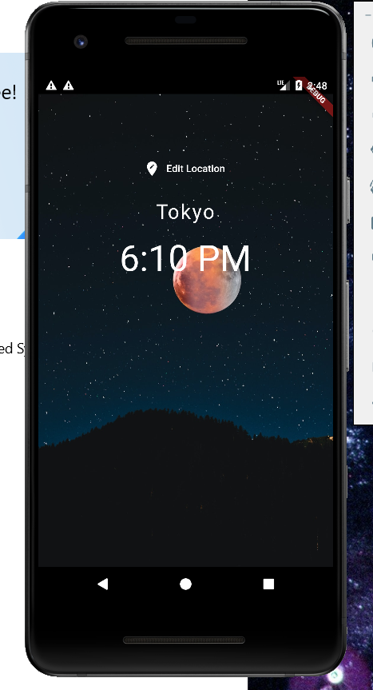
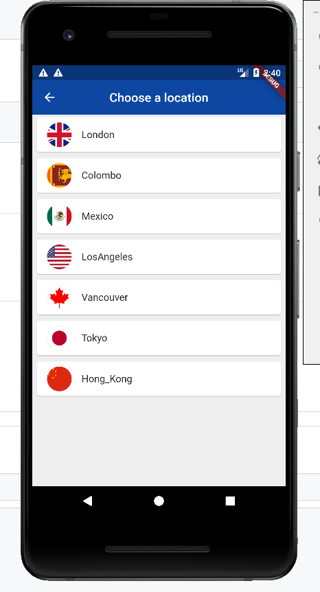

# world_time App

This is an simple **World Time** Flutter app which gives real live time of several regions around the world.

## Getting Started

Download the project and run using android studio IDE.

## How to run on a real device
Connect the android device you wish to run the World Time App using a usb cable to your PC which the Android Studio runs. Select the device in Flutter Device Selection pane on the top bar of the IDE. (*To show your device on the IDE you should allow the Developer Options and USB Debugging on the device*) 
It may takes several minutes on your first run.
After installation anytime you can run the app directly without PC.

